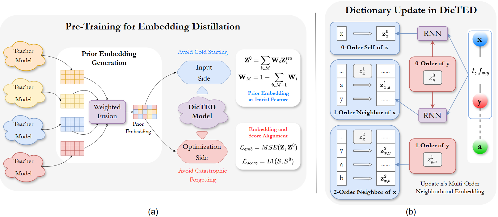
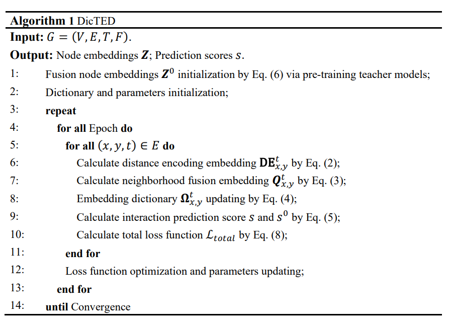
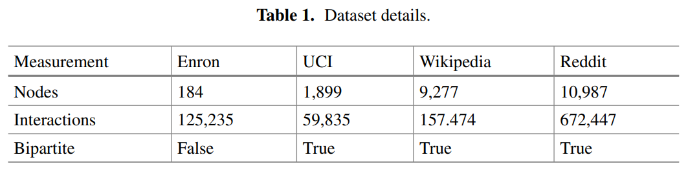
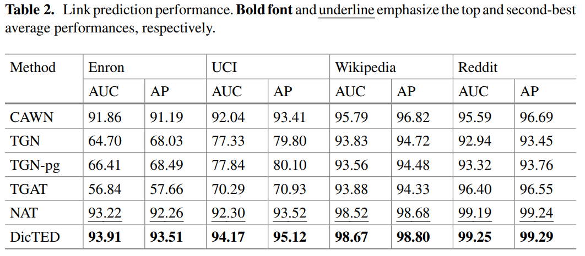
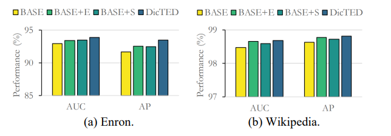
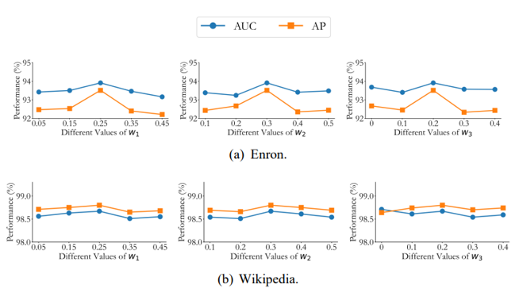

# DicTED: 基于预训练嵌入蒸馏的字典时序图神经网络

> 基于该项目的论文已发表于ICIC 2024 (CCF-C)

> 在时序图学习领域中，字典时序图网络是一项新兴的重要技术。与现有方法相比，字典网络在训练中的存储、更新和计算更为灵活，因而性能更优。但是，它仍然存在一些问题:(1)这种字典网络严重依赖可靠的原始特征，缺乏这些特征会带来冷启动问题;(2)在嵌入的不断更新过程中，可能会出现灾难性遗忘的问题。为解决这些问题，我们提出一种基于预训练嵌入蒸馏的字典时序图网络(DicTED)。DicTED通过引入预训练教师模型生成先验嵌入，结合对比损失，提升了模型的节点嵌入可靠性和新旧知识的平衡能力。

> 可访问 [作品主页](https://samer-hue.github.io/DicTED/README.html)、[论文全文](https://link.springer.com/chapter/10.1007/978-981-97-5678-0_29)。

## 技术背景与挑战

图结构作为一种强大的数学工具，被广泛应用于社交网络、生物网络、推荐系统和知识图谱等领域。时序图学习是在传统图学习的基础上引入时间维度，以更好地分析图的动态演变。然而，由于数据结构的限制，在训练过程中从不同角度获取丰富多样的信息是一大挑战，这往往导致现有方法在获取多源信息时复杂度增加。此外，频繁的更新和训练还会引发内存问题。<br>
为了解决这些挑战，字典时序图网络应运而生。该方法通过聚合邻域信息并以字典形式存储，在需要时进行匹配和提取，从而实现更灵活的存储、更新和计算。然而，这种方法仍存在以下问题：（1）字典网络过度依赖可靠的原始特征，缺乏这些特征会导致冷启动问题。在初始化阶段，如果没有可靠的特征集，模型难以在训练初期获得良好的优化，影响后续训练效果。（2）在嵌入不断更新的过程中，可能会出现灾难性遗忘问题。由于新知识不断覆盖旧知识，模型在训练后期逐渐失去对早期信息的掌握，影响信息的全面获取。

## 解决方案
针对上述问题，我们提出一个关键问题：如果引入技术来解决字典时序图网络中的问题，可能会引入更复杂的模块，这与字典网络的初衷相悖。在这种情况下，是否可以通过引入外部的先验知识来解决这些问题？基于此动机，我们提出了一种通过预训练嵌入蒸馏来增强字典时序图网络的新方案，称为**DicTED**。虽然知识蒸馏范式在现有工作中已被广泛应用，但尚无人将其扩展至字典时序图网络领域，这为我们提供了一个填补空白的机会。这种方法能够很好地解决冷启动和灾难性遗忘问题。<br>
我们通过引入多个预训练教师模型来生成嵌入，并将其融合为DicTED的先验特征。具体来说，针对上述问题：<br>
- **在输入端：**: 将先验特征与原始特征结合，以增强模型的初始化，从而使模型在训练中获得更好的信息和视角。
- **在优化端：**: 通过嵌入损失和预测得分损失来促使训练节点嵌入与先验特征尽可能对齐，从而在一定程度上保留原始信息。



## 实验结果

我们在多个真实数据集上的实验验证了DEDG的有效性。该实验以链路预测为目标任务，以AUC、AP为评估指标，数据集的信息和实验结果如下表：


我们还进行了消融实验和灵敏度实验。




## 关于代码的说明
### 运行环境
我们在同一台设备上运行了该项目，该设备配备了22个vCPU的AMD EPYC 7T83 64核处理器和一块24GB内存的RTX 4090显卡。<br>
其他依赖项:
```
PyTorch >= 1.4
python >= 3.7
pandas==1.4.3
tqdm==4.41.1
numpy==1.23.1
scikit_learn==1.1.2
```

### 运行项目
如果您想运行该项目，最简单的方法是运行以下命令，该命令将使用parser.py中指定的默认参数运行程序。
```
python main.py
```
如果您想自定义每个参数的值，请参考parser.py。例如，您可以运行以下命令：
```
python main.py -d wikipedia --n_hop 2 --run 2 --a1 0.3 --a2 0.3 --a3 0.2
```

### 参考资料
我们引入了一些用于嵌入蒸馏的预训练教师模型，以下是它们的开源代码：
```
https://github.com/tkipf/gae
https://github.com/bdy9527/SDCN
https://github.com/twitter-research/tgn
https://github.com/WenZhihao666/TREND
https://github.com/Graph-COM/Neighborhood-Aware-Temporal-Network
```

## 引用我们
如果您在自己的工作中使用此代码，请引用我们的论文:
```
@inproceedings{liu2024dictionary,
  title={Dictionary Temporal Graph Network via Pre-training Embedding Distillation},
  author={Liu, Yipeng and Zheng, Fang},
  booktitle={International Conference on Intelligent Computing},
  pages={336--347},
  year={2024},
  organization={Springer}
}
```
